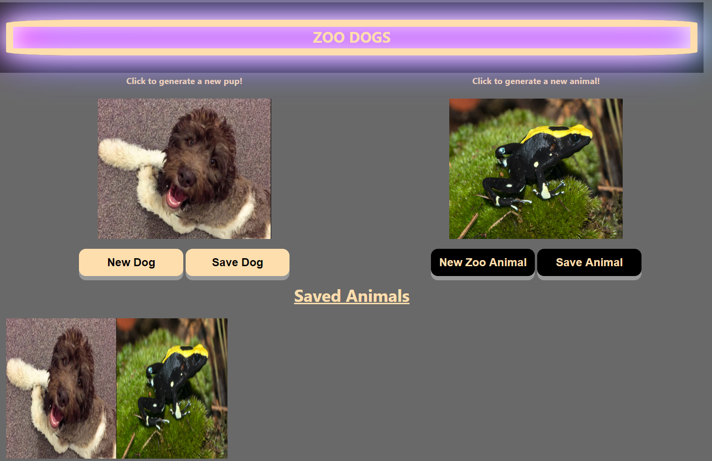

# Zoo Dogs

## Description

Create simple, yet entertaining random photo generators of dogs and zoo animals from the Dog API and Zoo Animal API's respectively. Links to both API's will be provided below. Using a combination of HTML, CSS, Javascript, and some additional styling from the Simple.CSS framework, this project is meant to allow users to randomly generate photos at the click of a button. If the user sees an image they particularly enjoy, there is also a save button that will send the image to their local storage.

## Steps Taken

* Build a framework of HTML to work around and build upon as needed. 

* Linked the Simple.CSS framework which provided preset stylings to the page. Since these styling are preset with the linking of the framework, not much can be found within the code itself. Much of the CSS file provides stylings that work around or overwrite Simple.CSS presets we did not wish to incorporate fully or at all. 

* API URL's were added to the JavaScript file as variable elements and linked to their respective 'generate' and 'save' buttons to provide to provide the ability to generate images and save them as desired. 

* Added placeholder images to both sections to provide some better spacing and scope to how the page looks as soon as the user lands.

## Webpage

NOTE: Screenshot below will not exactly represent what you see when you originally load in. The new image and save image buttons for the respective sections were clicked to generate images in the 'Saved Animals' section. When a new user first loads in they will see a placeholder image in each section and no images in the 'Saved Animals' section until they use the save buttons themselves.

Link: https://stricker2.github.io/zoo-dogs/

## Contributors

Project built by Dejuan Strong, Brendan Bischoff, & Andrew Secore